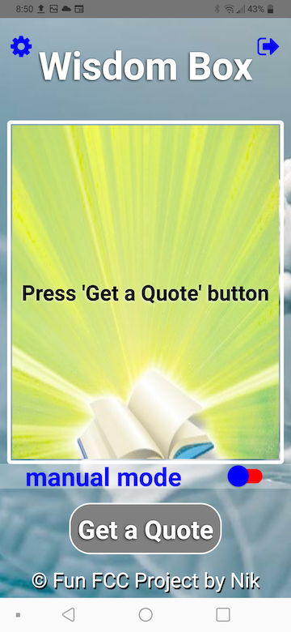

# wisdom box 3.0

In the project directory, you can run:

### `npm run start` or `react-native run-android`

Open development options:
### `adb shell input keyevent 82`

### Development

APP development - from idea to submitting to Google Play store: https://studio.youtube.com/channel/UCINLlkGAB1EDOcXrHfr8fMg/playlists

### Deployment

APP deployed at Google Play: https://play.google.com/store/apps/details?id=com.wbox

## Project Screenshots:

# wisdom-box
