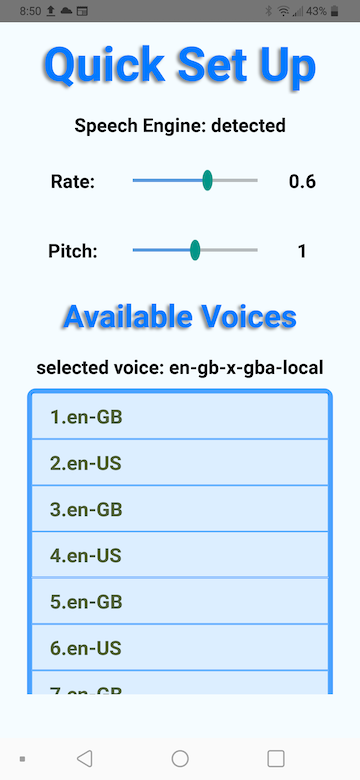

# wisdom box 3.0

## Wisdom Box APP development - from idea to submitting to Google Play

APP development - from idea to submitting to Google Play store: https://www.youtube.com/playlist?list=PL_HQqUUxw6OcyVFa0xW142Bv467nsJjlz

In the project directory, run to launch the project:

### `npm run start` or `react-native run-android`

Open development options:
### `adb shell input keyevent 82`

### Deployment

APP deployed at Google Play: https://play.google.com/store/apps/details?id=com.wbox

## Project Screenshots:

